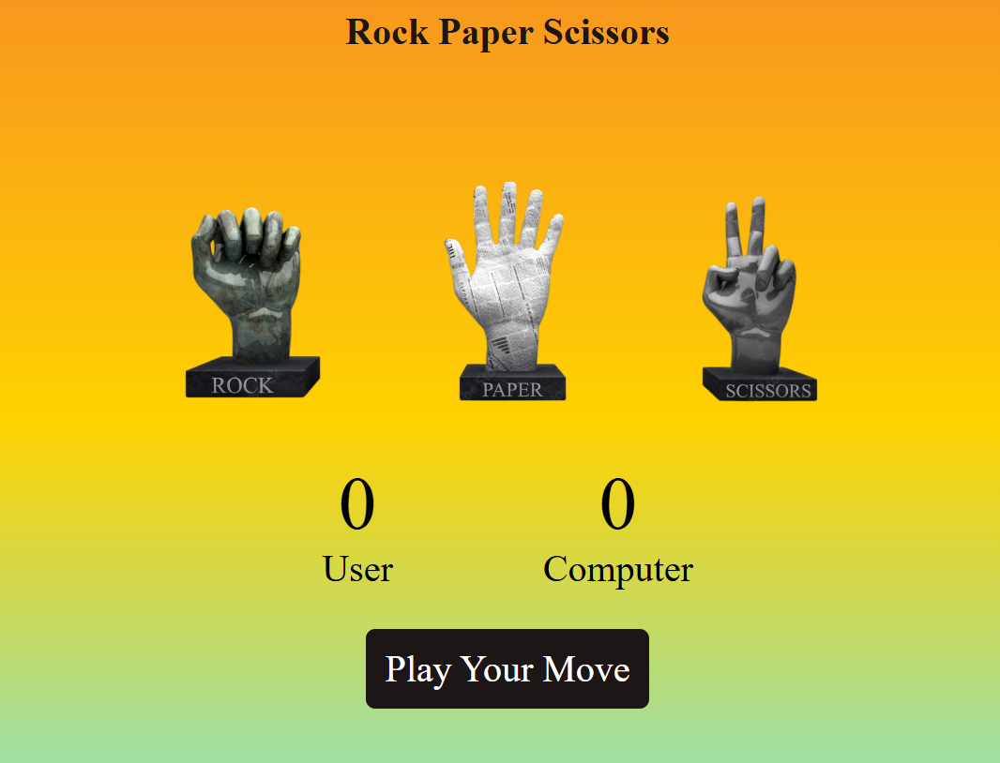

# Rock Paper Scissors Game

A simple and fun Rock Paper Scissors game built using HTML, CSS, and JavaScript. Challenge the computer and test your luck!

##  Demo

[Try This](https://parthaG23.github.io/rock-paper-scissors)  

---

##  Features

-  Random choice generator for the computer
-  Real-time results displayed after each round
-  Score tracking for both the player and computer
-  Responsive design for all screen sizes
-  Simple and clean UI

---

## Technologies Used

- **HTML** – for structuring the game layout
- **CSS** – for styling the UI
- **JavaScript** – for game logic and interactivity

---

## 📷 Screenshots

  

---

##  How to Run Locally

1. **Clone the repository**
   ```bash
   git clone https://github.com/ParthX-23/rock-paper-scissors.git
